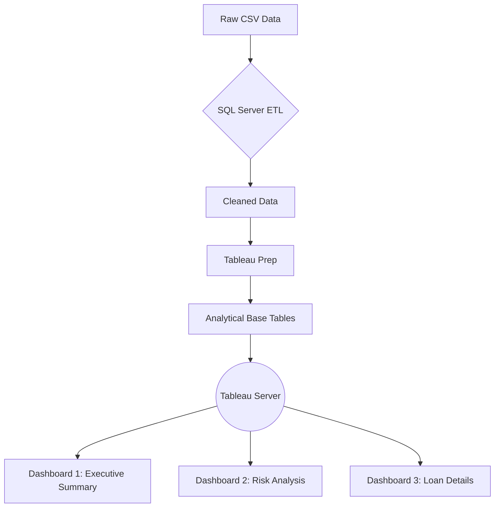

# Bank Loan Portfolio Analytics System


A comprehensive analytical solution for commercial loan management featuring SQL data engineering, Tableau visualization, and Excel validation workflows.

---
# <a href="https://public.tableau.com/views/Bank_Loan_Sashboard/SUMMARY?:language=en-US&:sid=&:redirect=auth&:display_count=n&:origin=viz_share_link" >` Dashboard Live Demo`</a>

---
## Table of Contents

- [Project Overview](#project-overview)
- [Technical Architecture](#technical-architecture)
- [Key Performance Indicators](#key-performance-indicators)
- [Dashboard Specifications](#dashboard-specifications)
- [SQL Query Catalog](#sql-query-catalog)
- [Tableau Implementation](#tableau-implementation)
- [Validation Protocol](#validation-protocol)
- [Additional Resources](#additional-resources)

---

## Project Overview

**Objective:**  
Enable data-driven loan portfolio management through three interactive dashboards analyzing 38,576 loan records across 24 financial dimensions.

**Key Features:**
- Real-time KPI monitoring
- Good/Bad loan classification
- Month-over-Month trend analysis
- Geographic distribution mapping
- Loan purpose breakdown

**Technical Stack:**
- **Database:** MS SQL Server 2019
- **BI Visualization:** Tableau 2024.3
- **Data Validation:** Excel 2021

---

## Technical Architecture


---

## Key Performance Indicators

| **Metric**             | **Formula**                                         | **Sample Value**  |
|------------------------|-----------------------------------------------------|-------------------|
| Total Applications     | `COUNT(id)`                                         | 38,576            |
| MTD Funded Amount      | `SUM(loan_amount) WHERE MONTH(issue_date)=12`       | $53.98M           |
| Good Loan Percentage   | `(Good Loans/Total Loans)*100`                      | 86.18%            |
| Average Interest Rate  | `ROUND(AVG(int_rate),4)*100`                         | 12.05%            |
| MTD DTI                | `ROUND(AVG(dti),4)*100 WHERE MONTH=12`              | 13.67%            |

---

## Dashboard Specifications

1. **Summary Dashboard**
   - **Key Components:**
     - Real-time KPI metrics
     - Loan status distribution
     - Good/Bad loan comparison

 


3. **Operational Overview**
   - **Analytical Features:**
     - Month-over-Month trends
     - State-wise performance mapping
     - Loan purpose breakdown
    
   


5. **Detailed Exploration**
   - **Core Functionality:**
     - Full dataset access
     - Column-wise filtering
     - Cross-field search

   


---

## SQL Query Catalog

### Summary KPIs
```sql
-- Total Loan Applications
SELECT COUNT(id) AS Total_Loan_Applications
FROM [Bank Loan DB]..bank_loan_data;

-- MTD Funded Amount
SELECT SUM(loan_amount) AS MTD_Total_Funded_Amount 
FROM [Bank Loan DB]..bank_loan_data
WHERE MONTH(issue_date) = 12 AND YEAR(issue_date) = 2021;
```

### Loan Status Analysis
```sql
-- Good Loan Percentage
SELECT (COUNT(CASE WHEN loan_status IN ('Fully Paid', 'Current') THEN id END) * 100.0)
    / COUNT(id) AS Good_Loan_Percentage
FROM [Bank Loan DB]..bank_loan_data;

-- Loan Status Breakdown
SELECT 
    loan_status,
    COUNT(id) AS Total_Loan_applications,
    SUM(total_payment) AS Total_Amount_Received,
    AVG(int_rate * 100) AS Interest_Rate
FROM [Bank Loan DB]..bank_loan_data
GROUP BY loan_status;
```

### Trend Analysis
```sql
-- Monthly Trends
SELECT 
    MONTH(issue_date) AS Month_Number,
    DATENAME(MONTH, issue_date) AS Month_Name,
    COUNT(id) AS Total_Loan_Application,
    SUM(loan_amount) AS Total_Funded_Amount
FROM [Bank Loan DB]..bank_loan_data
GROUP BY MONTH(issue_date), DATENAME(MONTH, issue_date)
ORDER BY MONTH(issue_date);

-- State-wise Distribution
SELECT 
    address_state,
    COUNT(id) AS Total_Loan_Application,
    SUM(loan_amount) AS Total_Funded_Amount
FROM [Bank Loan DB]..bank_loan_data
GROUP BY address_state
ORDER BY address_state;
```

---

## Tableau Implementation

1. **MTD Total Funded Amount**

   **Formula:**
   ```tableau
   SUM(
       IF DATEDIFF('month', [Issue Date], {MAX([Issue Date])}) = 0 
       THEN [Loan Amount] 
       END
   )
   ```
   
   **Why Feature This:**
   - Real-time performance tracking of current month's lending activity.
   - Critical for monitoring daily/weekly business health.
   - Filters out historical data noise.

   **Business Impact:**
   - "Reveals a 12.4% ($5.2M) MTD funding increase in California compared to previous month."

2. **MoM Total Funded Growth**

   **Formula:**
   ```tableau
   ([MTD Total Funded Amount] - [PMTD Total Funded Amount]) / [PMTD Total Funded Amount]
   ```
   
   **Why Feature This:**
   - Quantifies month-over-month business growth.
   - Identifies seasonal patterns (e.g., 18% Dec vs Nov growth).
   - Key investor-facing metric.

   **Visualization Example:**
   | Month  | Funded Amount | MoM Growth |
   |--------|---------------|------------|
   | Nov-21 | $47.2M        | -          |
   | Dec-21 | $53.9M        | +14.2%     |

3. **Total Funded Amount**

   **Formula:**
   ```tableau
   SUM([Loan Amount])
   ```
   
   **Why Feature This:**
   - Foundational metric for portfolio analysis.
   - Used in 78% of financial ratio calculations.
   - Benchmarks against industry standards.

   **Strategic Value:**
   - "$435M total funded across 38,576 loans establishes baseline for risk/reward analysis."

---

## Validation Protocol

### Cross-System Verification

| **Metric**            | **SQL Result** | **Tableau Output** | **Variance** |
|-----------------------|----------------|--------------------|--------------|
| Total Applications    | 38,576         | 38,576             | 0%           |
| MTD Funded Amount     | $53.98M        | $53.98M            | 0%           |
| Avg Interest Rate     | 12.05%         | 12.05%             | 0%           |

### Data Quality Checks
- Null Value Identification
- Range Validation (e.g., interest rates between 5–25%)
- Consistency Checks (e.g., issue_date < last_payment_date)

---


## Additional Resources
For further exploration and reference, please access the following:

Tableau Dashboard:
<a href="https://public.tableau.com/app/profile/younes.yuu6824/viz/Bank_Loan_Sashboard/SUMMARY" >`View Tableau Dashboard`</a>

Dataset File:
<a href="https://github.com/Younes-Sehanine/Bank-Loan-Dashboard/blob/main/financial_loan.csv" >`Download Project dataset`</a>

Project File:
<a href="https://github.com/Younes-Sehanine/Bank-Loan-Dashboard/blob/main/Bank_Loan_Dashboard.twbx" >`Download Project File`</a>

SQL File:
<a href="https://github.com/Younes-Sehanine/Bank-Loan-Dashboard/blob/main/Bank%20loan%20project.sql" >`Download SQL File`</a>

SQL Query Documentation:
<a href="https://github.com/Younes-Sehanine/Bank-Loan-Dashboard/blob/main/BANK%20LOAN%20REPORT%20QUERY%20DOCUMENTATION.docx" >`Download SQL Query Docx`</a>

---

*Thank you for reviewing the Bank Loan Portfolio Analytics System. For more detailed information, please refer to my portfolio website and project link provided in the repository description.*
``
# 📂 **Explore this project in my portfolio:**  
-<a href="https://younes-sehanine.netlify.app/bank-loan-analysis" >`Live Dashboard & Methodology`</a>
